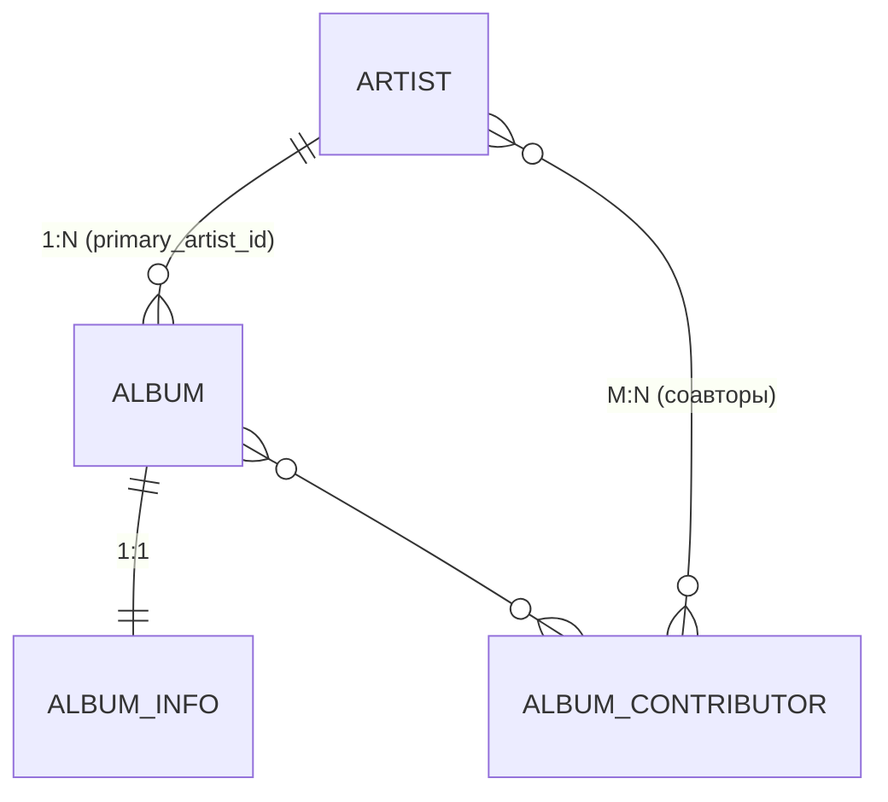
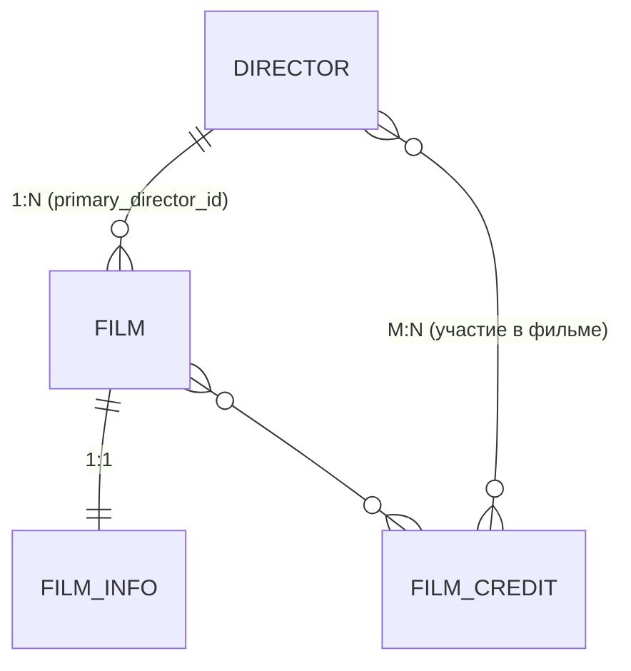
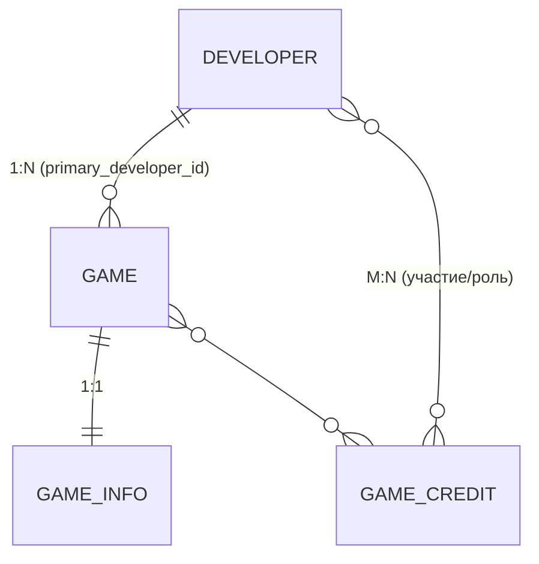
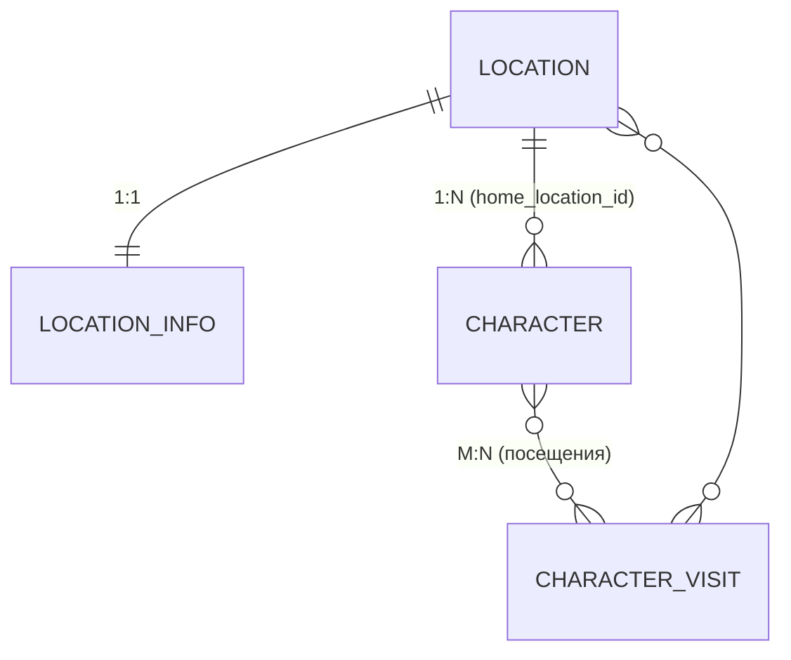
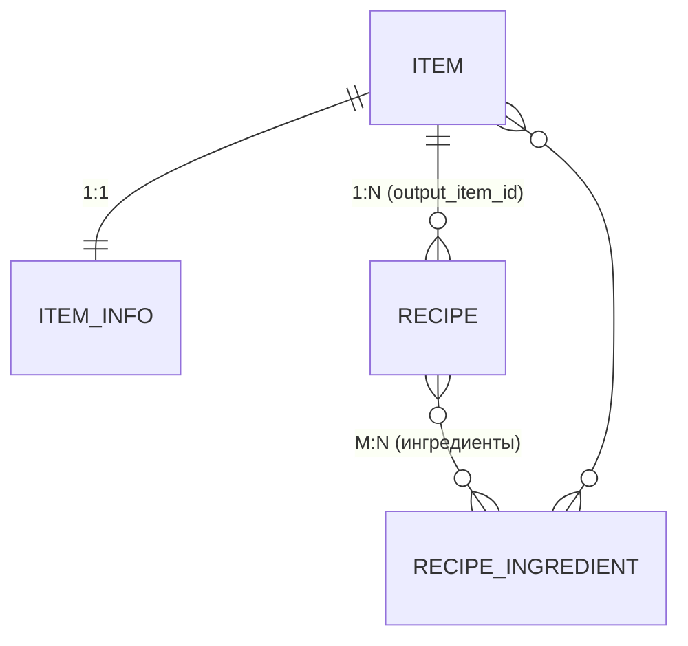

## Web 10. Основы PostgreSQL (максимальный балл 8, дедлай 18.11.2025 включительно)

---

### ‼️ Для отображения диаграмм нужно установить расширение с поддержкой Mermaid (я использую [Markdown Preview Mermaid Support](https://marketplace.visualstudio.com/items?itemName=bierner.markdown-mermaid) от автора Matt Bierner).

### ‼️ Описание нотации связей, используемой в Mermaid можно посмотреть [здесь](https://docs.mermaidchart.com/mermaid-oss/syntax/entityRelationshipDiagram.html#relationship-syntax)

---

### 🧾 Критерии оценивания

Вот **аддитивная шкала оценки (0–8 баллов)** для заданий по проектированию БД с разными типами связей (1:1, 1:N, M:N).
Каждый критерий оценивает отдельный аспект выполнения, и все баллы суммируются.

---

## Критерии оценки (максимум 8 баллов)

| №     | Критерий                                                | Что оценивается                                                                                                                                                | Баллы   |
| ----- | ------------------------------------------------------- | -------------------------------------------------------------------------------------------------------------------------------------------------------------- | ------- |
| **1** | **Корректность структуры таблиц**                       | Все таблицы созданы, их состав соответствует заданию (названия, поля, типы данных выбраны уместно). Нет пропущенных таблиц или ключевых полей.                 | **1** |
| **2** | **Связь 1:1**                    | Связь реализована корректно.         | **2** |
| **3** | **Связь 1:N**                    | Связь реализована корректно.         | **2** |
| **4** | **Связь M:N**                    | Связь реализована корректно.         | **2** |
| **5** | **Ключи и ограничения целостности**                     | Указаны первичные и внешние ключи, ограничения `NOT NULL`, `UNIQUE`, `CHECK`, `ON DELETE` в соответствии с условием. Нет нарушений ссылочной целостности.      | **1** |

---

### ⚠️ Штрафы за стиль (до –2 баллов суммарно)

* Смешанный регистр ключевых слов (`create TABLE` вместо `CREATE TABLE`) — −0.5
* Отсутствие отступов или переносов строк — −0.5
* CamelCase в именах таблиц/колонок — −0.5
* Отсутствие `;` в конце операторов — −0.5

---

<strong style="font-size: 16px;">Задача 1</strong>

---

## Задание: «Музыкальный каталог — артисты и альбомы»

Спроектируйте базу данных из **4 таблиц**, которая демонстрирует все типы связей:

* **One-to-One (1:1)**
* **One-to-Many (1:N)**
* **Many-to-Many (M:N)**

---

## Диаграмма сущностей и связей

```mermaid
erDiagram
    ARTIST ||--o{ ALBUM : "1:N (primary_artist_id)"
    ALBUM ||--|| ALBUM_INFO : "1:1"
    ARTIST }o--o{ ALBUM_CONTRIBUTOR : "M:N (соавторы)"
    ALBUM  }o--o{ ALBUM_CONTRIBUTOR : ""
```

---

## Описание сущностей

### 1. ARTIST

* **id** — первичный ключ
* **name** — имя артиста (уникальное)
* **country** — страна (опционально)

---

### 2. ALBUM

* **id** — первичный ключ
* **title** — название альбома
* **release_year** — год выпуска
* **primary_artist_id** — внешний ключ на `ARTIST(id)`

**Связь:**
Один артист может выпустить несколько альбомов → это **связь 1:N** между `ARTIST` и `ALBUM`.

---

### 3. ALBUM_INFO

* **album_id** — внешний ключ на `ALBUM(id)` и одновременно первичный ключ
* **upc** — уникальный код альбома
* **label** — издатель
* **duration_minutes** — длительность в минутах

**Связь:**
Каждый альбом имеет ровно одну дополнительную запись с информацией → это **связь 1:1** между `ALBUM` и `ALBUM_INFO`.

---

### 4. ALBUM_CONTRIBUTOR

* **album_id** — внешний ключ на `ALBUM(id)`
* **artist_id** — внешний ключ на `ARTIST(id)`
* **role** — роль артиста (например, «producer», «featured», «mixer»)
* **первичный ключ (album_id, artist_id, role)**

**Связь:**
Один артист может участвовать в создании множества альбомов, и один альбом может иметь много артистов-участников → это **связь M:N**, реализованная через таблицу `ALBUM_CONTRIBUTOR`.

---

## Требования к реализации

1. Создать 4 таблицы с указанными полями и связями.
2. Для связи **1:N**:

   * поле `primary_artist_id` в таблице `ALBUM` обязательно (`NOT NULL`)
   * внешний ключ `primary_artist_id` ссылается на `ARTIST(id)`
3. Для связи **1:1**:

   * в таблице `ALBUM_INFO` ключ `album_id` является и **PK**, и **FK** на `ALBUM(id)`
4. Для связи **M:N**:

   * таблица `ALBUM_CONTRIBUTOR` содержит составной первичный ключ `(album_id, artist_id, role)`
   * оба поля `album_id` и `artist_id` являются внешними ключами
5. Ограничения целостности данных:

   * `release_year` — проверить, что значение не меньше 1900 и не больше текущего года
   * `duration_minutes` — должно быть больше 0
   * `upc` — уникальное
6. Поведение при удалении:

   * удаление артиста запрещено, если он указан как `primary_artist` в альбоме (`ON DELETE RESTRICT`)
   * удаление альбома должно автоматически удалять связанные записи в `ALBUM_INFO` и `ALBUM_CONTRIBUTOR` (`ON DELETE CASCADE`)

---

<strong style="font-size: 16px;">Задача 2</strong>

## Задание: «Кинопрокат — режиссёры и фильмы»

Спроектируйте базу данных из **4 таблиц**, демонстрирующую связи:

* **One-to-One (1:1)**
* **One-to-Many (1:N)**
* **Many-to-Many (M:N)**

---

## Диаграмма сущностей и связей

```mermaid
erDiagram
    DIRECTOR ||--o{ FILM : "1:N (primary_director_id)"
    FILM ||--|| FILM_INFO : "1:1"
    DIRECTOR }o--o{ FILM_CREDIT : "M:N (участие в фильме)"
    FILM     }o--o{ FILM_CREDIT : ""
```

---

## Описание сущностей

### 1. DIRECTOR

* **id** — первичный ключ
* **name** — ФИО режиссёра (уникальное)
* **country** — страна (опционально)

### 2. FILM

* **id** — первичный ключ
* **title** — название фильма
* **release_year** — год релиза
* **primary_director_id** — внешний ключ на `DIRECTOR(id)`

**Связь:** один режиссёр может быть «основным» для многих фильмов → **1:N** `DIRECTOR` → `FILM`.

### 3. FILM_INFO

* **film_id** — внешний ключ на `FILM(id)` и одновременно первичный ключ
* **duration_minutes** — длительность в минутах
* **rating** — возрастной рейтинг (например, `G`, `PG`, `PG-13`, `R`, `NC-17`)
* **budget_usd** — бюджет

**Связь:** на каждый фильм ровно одна запись с расширенной информацией → **1:1** `FILM` ↔ `FILM_INFO`.

### 4. FILM_CREDIT

* **film_id** — внешний ключ на `FILM(id)`
* **director_id** — внешний ключ на `DIRECTOR(id)`
* **role** — роль участника (например, `director`, `co-director`, `producer`)
* **первичный ключ (film_id, director_id, role)**

**Связь:** многие режиссёры (как участники в разных ролях) могут быть связаны с многими фильмами → **M:N** через `FILM_CREDIT`.

---

## Требования к реализации

1. Создать 4 таблицы с указанными полями и связями.
2. **1:N**:

   * `FILM.primary_director_id` — `NOT NULL`, `FOREIGN KEY` → `DIRECTOR(id)`.
3. **1:1**:

   * в `FILM_INFO` поле `film_id` является и **PK**, и **FK** на `FILM(id)`, обеспечивая ровно одну строку на фильм.
4. **M:N**:

   * таблица `FILM_CREDIT` с составным **PK** `(film_id, director_id, role)`; поля `film_id` и `director_id` — внешние ключи.
5. Ограничения целостности:

   * `release_year` — `CHECK (release_year BETWEEN 1900 AND extract(year from current_date))`
   * `duration_minutes` — `CHECK (duration_minutes > 0)`
   * `rating` — `CHECK (rating IN ('G','PG','PG-13','R','NC-17'))`
   * `name` в `DIRECTOR` — **UNIQUE**
6. Поведение при удалении:

   * удаление режиссёра запрещено, если он указан как основной (`primary_director_id`) в каком-либо фильме — `ON DELETE RESTRICT` (или `NO ACTION`).
   * удаление фильма должно автоматически удалять связанные строки в `FILM_INFO` и `FILM_CREDIT` — `ON DELETE CASCADE`.

---

## Что нужно сдать

1. **SQL-скрипт** создания всех таблиц и ограничений (`CREATE TABLE` + `ALTER TABLE`).
2. **Краткое описание** (несколько строк), где указано:

   * где реализована связь **1:1**;
   * где реализована связь **1:N**;
   * где реализована связь **M:N**;
   * какими ключами/ограничениями это обеспечивается.

---

<strong style="font-size: 16px;">Задача 3</strong>

## Задание: «Игровая индустрия — разработчики и игры»

Спроектируйте базу данных из **4 таблиц**, демонстрирующую связи:

* **One-to-One (1:1)**
* **One-to-Many (1:N)**
* **Many-to-Many (M:N)**

---

## Диаграмма сущностей и связей

```mermaid
erDiagram
    DEVELOPER ||--o{ GAME : "1:N (primary_developer_id)"
    GAME ||--|| GAME_INFO : "1:1"
    DEVELOPER }o--o{ GAME_CREDIT : "M:N (участие/роль)"
    GAME      }o--o{ GAME_CREDIT : ""
```

---

## Описание сущностей

### 1. DEVELOPER

* **id** — первичный ключ
* **name** — название студии/разработчика (**UNIQUE**)
* **country** — страна (опционально)

### 2. GAME

* **id** — первичный ключ
* **title** — название игры
* **release_year** — год релиза
* **primary_developer_id** — внешний ключ на `DEVELOPER(id)` (**NOT NULL**)

**Связь 1:N:** одна студия может быть «основным разработчиком» многих игр.

### 3. GAME_INFO

* **game_id** — внешний ключ на `GAME(id)` и одновременно **первичный ключ**
* **engine** — используемый движок (например, *Unity*, *Unreal*, *Godot*)
* **age_rating** — возрастной рейтинг (например, `E`, `T`, `M`, `AO`)
* **playtime_hours** — средняя продолжительность прохождения, часы (целое/числовое)

**Связь 1:1:** для каждой игры ровно одна расширенная запись.

### 4. GAME_CREDIT

* **game_id** — внешний ключ на `GAME(id)`
* **developer_id** — внешний ключ на `DEVELOPER(id)`
* **role** — роль участника (например, `co-dev`, `outsourcing`, `audio`, `writer`)
* **первичный ключ (game_id, developer_id, role)** — запрещает дубликаты одной и той же роли для пары игра–разработчик

**Связь M:N:** множество студий могут участвовать в создании множества игр в разных ролях.

---

## Требования к реализации

1. Создать 4 таблицы с указанными полями и связями.
2. **1:N:**

   * `GAME.primary_developer_id` — `NOT NULL`, `FOREIGN KEY` → `DEVELOPER(id)`.
3. **1:1:**

   * в `GAME_INFO` поле `game_id` является и **PK**, и **FK** на `GAME(id)`, обеспечивая ровно одну строку на игру.
4. **M:N:**

   * таблица `GAME_CREDIT` с составным **PK** `(game_id, developer_id, role)`; поля `game_id` и `developer_id` — внешние ключи.
5. Ограничения целостности:

   * `DEVELOPER.name` — **UNIQUE**.
   * `release_year` — `CHECK (release_year BETWEEN 1970 AND extract(year from current_date))`.
   * `age_rating` — `CHECK (age_rating IN ('E','T','M','AO'))`.
   * `playtime_hours` — `CHECK (playtime_hours > 0)`.
6. Поведение при удалении:

   * удаление разработчика запрещено, если он указан как основной `primary_developer_id` в каком-либо `GAME` — `ON DELETE RESTRICT` (или `NO ACTION`).
   * удаление игры должно каскадно удалять связанные записи в `GAME_INFO` и `GAME_CREDIT` — `ON DELETE CASCADE`.

---

<strong style="font-size: 16px;">Задача 4</strong>

## Задание: «Игровой мир — локации и персонажи»

Спроектируйте базу данных из **4 таблиц**, демонстрирующую связи:

* **One-to-One (1:1)**
* **One-to-Many (1:N)**
* **Many-to-Many (M:N)**

---

## Диаграмма сущностей и связей

```mermaid
erDiagram
    LOCATION ||--|| LOCATION_INFO : "1:1"
    LOCATION ||--o{ CHARACTER : "1:N (home_location_id)"
    CHARACTER }o--o{ CHARACTER_VISIT : "M:N (посещения)"
    LOCATION  }o--o{ CHARACTER_VISIT : ""
```

---

## Описание сущностей

### 1. LOCATION

* **id** — первичный ключ
* **name** — название локации (**UNIQUE**)
* **region** — регион/биом (например, `Forest`, `Desert`, `Tundra`)

**Связи:**

* **1:1** с `LOCATION_INFO` (подробные параметры локации)
* **1:N** с `CHARACTER` через поле `CHARACTER.home_location_id` (жители локации)
* участвует в **M:N** через таблицу `CHARACTER_VISIT` (множество персонажей посещают множество локаций)

---

### 2. LOCATION_INFO

* **location_id** — внешний ключ на `LOCATION(id)` и одновременно **первичный ключ**
* **danger_level** — уровень опасности (целое 1–10)
* **climate** — климат/погодная зона (например, `Temperate`, `Arid`, `Polar`)
* **fast_travel_unlocked** — boolean: доступна ли быстрая перемещалка

**Связь:**
Ровно одна строка на локацию → **1:1** с `LOCATION`.
Требования: `danger_level` — `CHECK (danger_level BETWEEN 1 AND 10)`.

---

### 3. CHARACTER

* **id** — первичный ключ
* **name** — имя персонажа (**UNIQUE**)
* **class** — класс (например, `Warrior`, `Mage`, `Rogue`)
* **home_location_id** — внешний ключ на `LOCATION(id)` (**NOT NULL**)

**Связь:**
Одна локация имеет много «родных» персонажей → **1:N** между `LOCATION` и `CHARACTER`.

---

### 4. CHARACTER_VISIT

* **character_id** — внешний ключ на `CHARACTER(id)`
* **location_id** — внешний ключ на `LOCATION(id)`
* **visited_at** — дата/время визита
* **purpose** — цель визита (например, `quest`, `trade`, `explore`)
* **первичный ключ (character_id, location_id, visited_at)** — одна запись на конкретный визит

**Связь:**
Многие персонажи посещают многие локации в разное время → **M:N** через `CHARACTER_VISIT`.

---

## Требования к реализации

1. Создать ровно **4 таблицы** с указанными полями и связями.
2. **1:1:** `LOCATION_INFO.location_id` является и **PK**, и **FK** на `LOCATION(id)` — гарантирует единственную строку с деталями на каждую локацию.
3. **1:N:** `CHARACTER.home_location_id` — **NOT NULL**, внешний ключ на `LOCATION(id)`.
4. **M:N:** реализована через `CHARACTER_VISIT` с составным **PK** `(character_id, location_id, visited_at)`; оба поля `character_id` и `location_id` — внешние ключи.
5. Ограничения целостности и удобства:

   * `LOCATION.name` и `CHARACTER.name` — **UNIQUE**.
   * `LOCATION_INFO.danger_level` — `CHECK (1–10)`.
   * `visited_at` — не в будущем: `CHECK (visited_at <= now())`.
6. Поведение при удалении:

   * удаление локации должно каскадно удалять `LOCATION_INFO` и записи посещений `CHARACTER_VISIT` для этой локации — `ON DELETE CASCADE`; удаление локации **запрещено**, если есть персонажи с `home_location_id` на неё — `ON DELETE RESTRICT` (или `NO ACTION`).
   * удаление персонажа должно каскадно удалять его записи из `CHARACTER_VISIT` — `ON DELETE CASCADE`.

---

<strong style="font-size: 16px;">Задача 5</strong>

## Задание: «Игровой мир — рецепты и крафт»

Спроектируйте базу данных из **4 таблиц**, которая демонстрирует:

* **One-to-One (1:1)**
* **One-to-Many (1:N)**
* **Many-to-Many (M:N)**

---

## Диаграмма сущностей и связей

```mermaid
erDiagram
    ITEM ||--|| ITEM_INFO : "1:1"
    ITEM ||--o{ RECIPE : "1:N (output_item_id)"
    RECIPE }o--o{ RECIPE_INGREDIENT : "M:N (ингредиенты)"
    ITEM   }o--o{ RECIPE_INGREDIENT : ""
```

---

## Описание сущностей

### 1. ITEM

* **id** — первичный ключ
* **name** — название предмета (**UNIQUE**)
* **rarity** — редкость (например, `common`, `rare`, `epic`, `legendary`)
* **stack_limit** — максимальный размер стека (целое > 0)

**Связи:**

* **1:1** с `ITEM_INFO` по `id`
* **1:N**: на один предмет может существовать несколько вариантов рецептов его создания (`RECIPE.output_item_id → ITEM.id`)
* участвует в **M:N** как ингредиент через `RECIPE_INGREDIENT`

---

### 2. ITEM_INFO

* **item_id** — внешний ключ на `ITEM(id)` и одновременно **первичный ключ**
* **weight** — вес предмета (число ≥ 0)
* **is_tradeable** — можно ли торговать (`boolean`)
* **durability_max** — максимальная прочность (целое ≥ 0)

**Связь:**
Ровно одна строка расширенной информации на каждый предмет → **1:1** с `ITEM`.

---

### 3. RECIPE

* **id** — первичный ключ
* **name** — название рецепта (**UNIQUE**)
* **output_item_id** — внешний ключ на `ITEM(id)` (**NOT NULL**) — какой предмет получается в результате
* **craft_time_seconds** — время крафта в секундах (целое > 0)
* **required_station** — требуемая станция (например, `campfire`, `anvil`, `alchemy_table`)

**Связь:**
Один предмет (результат) может иметь много рецептов → **1:N** между `ITEM` и `RECIPE`.

---

### 4. RECIPE_INGREDIENT

* **recipe_id** — внешний ключ на `RECIPE(id)`
* **item_id** — внешний ключ на `ITEM(id)`
* **quantity** — количество ингредиента (целое > 0)
* **первичный ключ (recipe_id, item_id)** — один ингредиент в рецепте описывается единственной строкой

**Связь:**
Многие рецепты используют многие предметы как ингредиенты → **M:N** через `RECIPE_INGREDIENT`.

---

## Требования к реализации

1. Создать **ровно 4 таблицы** с указанными полями и связями.
2. **1:1:** `ITEM_INFO.item_id` является и **PK**, и **FK** на `ITEM(id)`.
3. **1:N:** `RECIPE.output_item_id` — **NOT NULL**, `FOREIGN KEY` → `ITEM(id)`.
4. **M:N:** реализована через `RECIPE_INGREDIENT` с составным **PK** `(recipe_id, item_id)`; оба поля — внешние ключи.
5. Ограничения целостности:

   * `ITEM.name` и `RECIPE.name` — **UNIQUE**;
   * `stack_limit > 0`, `weight ≥ 0`, `durability_max ≥ 0`, `craft_time_seconds > 0`;
   * при желании зафиксируйте домен редкости и станций через `CHECK (...) IN (...)`.
6. Поведение при удалении:

   * удаление предмета должно удалять связанную строку `ITEM_INFO` — `ON DELETE CASCADE`;
   * удаление рецепта должно удалять его ингредиенты — `ON DELETE CASCADE`;
   * удаление предмета, который используется как **результат** (`RECIPE.output_item_id`) или как **ингредиент** (`RECIPE_INGREDIENT.item_id`), допустимо **только** если это явно предусмотрено — по умолчанию используйте `ON DELETE RESTRICT` (или `NO ACTION`) для сохранения целостности.

